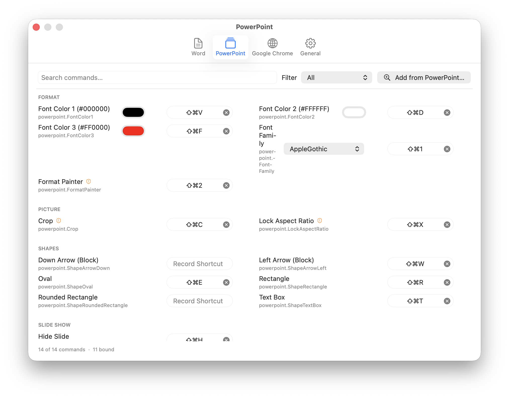
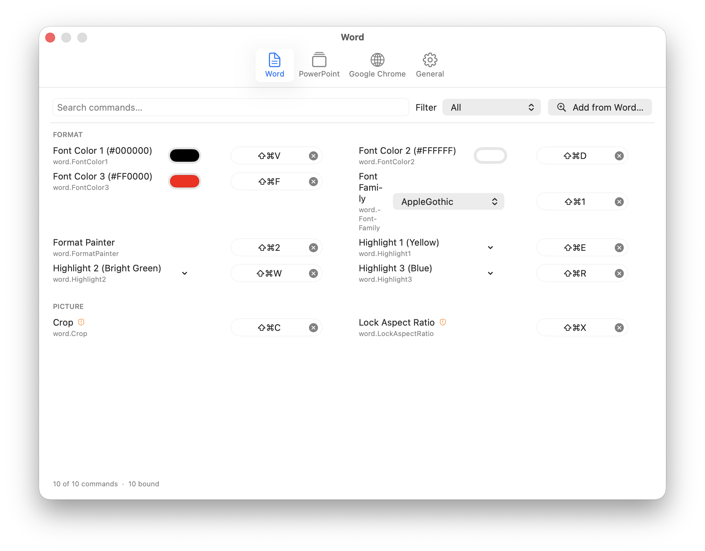
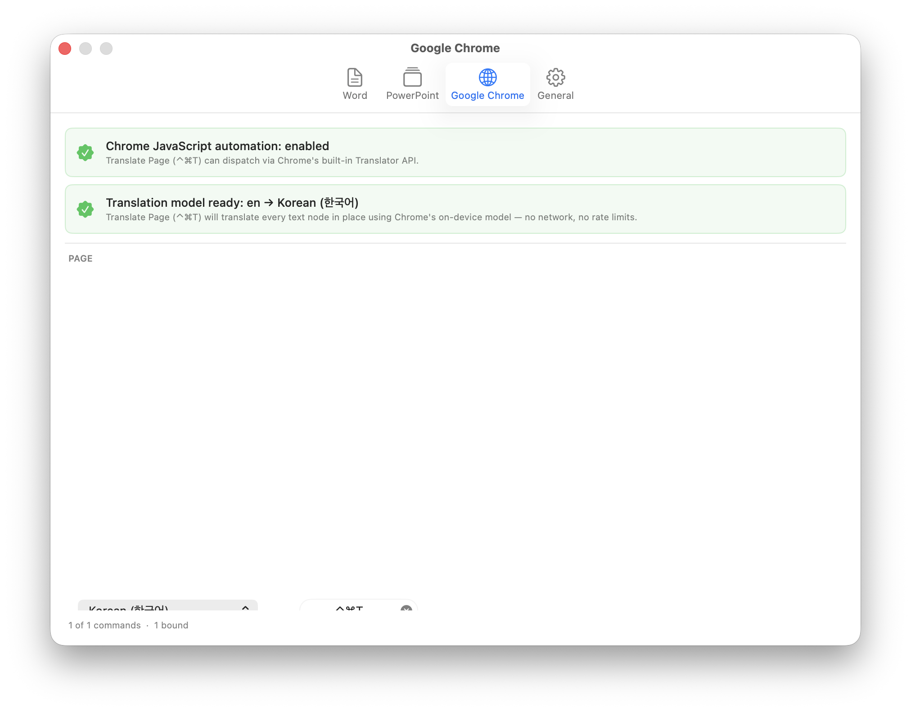
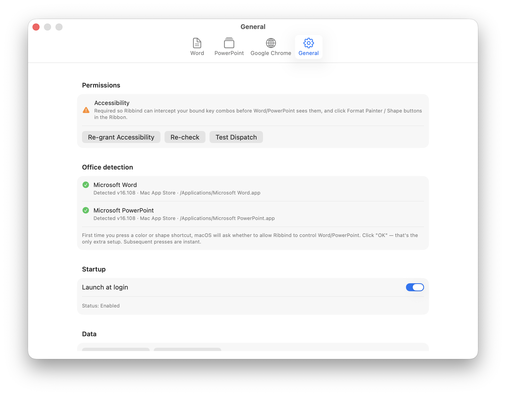

# Ribbind

🌐 [English](./README.md) · **한국어**

macOS의 Microsoft Word, PowerPoint, Google Chrome 명령에 키보드 단축키를 바인딩합니다 — System Settings로는 닿을 수 없는 Ribbon-전용 버튼까지. 현재 **v0.6.0**.

[](https://ko-fi.com/minguk2)

---

## 설치

터미널 열기 (`⌘ + Space` → `Terminal`).

**1. Apple Command Line Tools 설치** (1회, 무료):

```sh
xcode-select --install
```

**2. Ribbind 빌드 + 설치:**

```sh
cd ~/Downloads
git clone https://github.com/minguk2/ribbind.git
cd ribbind
scripts/build-app.sh release
pkill -f /Applications/Ribbind.app 2>/dev/null; sleep 1
rm -rf /Applications/Ribbind.app
mv dist/Ribbind.app /Applications/
open /Applications/Ribbind.app
```

빌드 ~30초. Ribbind은 메뉴바에 자리 잡습니다 (Dock 아이콘 없음).

**3. Accessibility 허용** + 첫 Word / PowerPoint / Chrome 단축키 사용 시 **Automation** 허용. 각각 시스템 다이얼로그에서 1번 클릭.

메뉴바 아이콘에서 Settings 열기, 또는 `⌘,`.

---

## 바인딩 가능한 명령

### PowerPoint



- **Format** — Format Painter, Font Color 1/2/3 (RGB picker), Font Family
- **Picture** — Crop, Lock Aspect Ratio
- **Shapes** — Text Box, Oval, Rectangle, Rounded Rectangle, Down Arrow, Left Arrow
- **Slide Show** — Hide Slide

메뉴 접근 가능한 4개 도형은 PowerPoint 드래그 커서를 무장합니다 (Insert → Shape 클릭과 동일).

### Word



- **Format** — Format Painter, Highlight 1/2/3 (명명색), Font Color 1/2/3 (RGB), Font Family
- **Picture** — Crop, Lock Aspect Ratio

Highlight는 Word 표준 `<w:highlight>`를 쓰므로 홈 리본의 *No Color* 버튼이 정상 작동합니다.

### Google Chrome



- **Translate Page (toggle)** — 18개 언어 중 선택. 단축키 1번 → Chrome on-device Translator API로 페이지 in-place 번역. 1번 더 → 원본 복원.

커서 안 움직이고 UI flicker 0, API key 0, 번역 시 네트워크 0.

Chrome 탭에서 일회성 setup 두 가지:
1. *Chrome > View > Developer > Allow JavaScript from Apple Events* (Chrome 프로필별).
2. Ribbind에서 **Initialize translation model** 클릭 → Chrome 페이지 어디든 1번 클릭. Chrome이 on-device 모델 다운로드 (페어당 ~50 MB).

### Per-binding 파라미터

Highlight / Font Color / Font Family / Translate 각 행에 자체 picker (색상 swatch, RGB well, 폰트 메뉴, 언어 메뉴). Export / import 시에도 유지.

*Crop* / *Lock Aspect Ratio* 옆 ⚠ 는 **이미지 선택** 필요.

**다른 명령이 필요하면** *Add from Word… / Add from PowerPoint…* 클릭. Ribbind이 Ribbon 버튼 / 메뉴 항목을 라이브로 읽습니다. 새 기능은 **[Issue 등록](../../issues/new)**.

---

## 권한



| 권한 | 시점 | 이유 |
|---|---|---|
| **Accessibility** | 첫 실행 | Office / Chrome이 키 입력 받기 전 가로채기 |
| **Automation** (Word / PPT) | 첫 Word / PPT 단축키 | 서식 적용, 도형 삽입 |
| **Automation** (Chrome) | 첫 Translate 단축키 | 활성 탭에 번역 JS 실행 |

추가로 Chrome 측 토글 1개 (시스템 권한 아님): *View > Developer > Allow JavaScript from Apple Events*. Ribbind Chrome 탭이 한 번에 안내합니다.

**General** 탭 라이브 상태: Accessibility 체크, Office 검출, Launch at login, Import / Export.

---

## FAQ

**단축키가 안 됨?** (1) 대상 앱이 frontmost인지, (2) **현재** `/Applications/Ribbind.app`에 Accessibility 권한 있는지 (재빌드 시 signature 회전 — System Settings → Accessibility에서 Ribbind 재추가), (3) PowerPoint 메뉴 단축키는 launch 시점에만 등록됨 — 종료 / 재시작.

**Chrome ⌃⌘T 가 안 됨 / 알림 뜸?** Settings → Google Chrome 의 두 setup 모두 초록 ✓ 인지 확인. 첫 모델 다운로드는 *Initialize* 클릭 후 안내 따라가기.

**Apple Developer 계정 필요?** 아니오. 무료 Command Line Tools 사용.

**인터넷 통신?** Chrome 모델 1회 다운로드 외엔 없음. 번역은 on-device. 텔레메트리 / 자동 업데이트 모두 없음.

**기존 Word 커스터마이즈와 충돌?** 없음 — Ribbind은 Word *Customize Keyboard* 가 쓰는 파일에 씁니다. 충돌 시 가장 최근 할당 우선.

**업데이트?**

```sh
cd ~/Downloads/ribbind && git pull && scripts/build-app.sh release && \
  pkill -f /Applications/Ribbind.app 2>/dev/null; sleep 1 && \
  rm -rf /Applications/Ribbind.app && \
  mv dist/Ribbind.app /Applications/ && open /Applications/Ribbind.app
```

Accessibility 재허용 필요할 수 있음.

---

## 제거

1. 메뉴바에서 Ribbind 종료.
2. `rm -rf /Applications/Ribbind.app`
3. *(선택)* `rm -rf ~/Downloads/ribbind` + System Settings에서 Accessibility / Automation 해제.

---

## 라이선스

[MIT](./LICENSE). Vendored [KeyboardShortcuts](https://github.com/sindresorhus/KeyboardShortcuts) 도 자체 MIT.

도움이 됐다면 [Ko-fi 커피](https://ko-fi.com/minguk2) 환영합니다.
